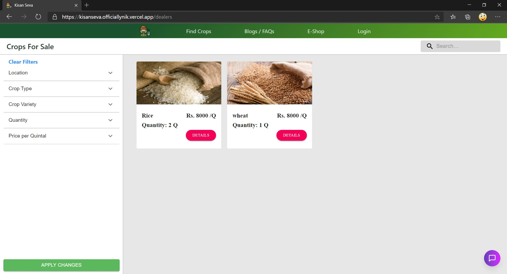

# Kisan Seva

An app that serves the farmer community the purpose of fetching them right value for there crops. Also educate and provide best practises for free to farmers on all kinds of agricultural aspects.

## Getting Started

These instructions will get you a copy of the project up and running on your local machine for development and testing purposes. See deployment for notes on how to deploy the project on a live system.

### Prerequisites

* NodeJS JavaScript Runtime.
* Node Package Manager (npm).
* Git

### Installing

A step by step series of examples that tell you how to get a development env running

```
git clone https://github.com/officiallynik/SEWebProject.git
cd SEWebProject/
npm install
```
#### Running the application (locally)
```
npm run dev
open 'http://localhost:3000' in the browser
```
#### Building a local production application
```
npm run build
npm run export
* 'out' directory will have the production build of the application.
```

## Deployment

1. Develop new features or fix bugs locally, with unit tests.
2. Push code to your local repository on github.
3. Issue a pull request to the master branch of this repository.
4. After verification code to be pulled into master branch.
5. After passing all tests successfull application will automatically be deployed. 

## Principles to be followed
1. This application is developed to be optimised for all screen types
2. All components and pages should be responsive, i.e., change according to screen size.
3. Components and pages will have to be optimised for large (desktop), medium (tablets) and small (mobile) screens.  

## Features of App

 

* The app allows users to register themselves on app and then login to view the all functionalities of app as farmer or dealer
* Then user will be taken to respective home pages to continue using the app.

  
  

* The farmers' can sell the their products by providing necessary details.
* Add thumbnail, and add photos* to display for dealers
    * *optional

  

* The farmers' can manage everything related to posting and their profile in farmers' dashboard.

  

* The dealers' can bid-on and view all crops listing in 'find crops' page.
* Only dealers' can view details and bid on crops. 



* The dealers' can manage everything related to profile and bids in dealers' dashboard just as farmers.


* E-Shops are open to be shoped by farmers' though price comparison feature is coming soon.


* More features coming soon, like blogs and faqs, loan / insurance, chat with experts and more.


## Built With

* [TypeScript](https://www.typescriptlang.org/) - Superset of javascript with support for types
* [NextJS](https://nextjs.org/) - Framework based on react for production and server side rendering
* [ReactJS](https://reactjs.org/) - JavaScript library for building user interfaces 
* [Material-UI](https://material-ui.com/) - React component and styling library based on 'material design' by google
* [Redux](https://redux.js.org/) - State management library for javascript apps

## Contributing

Fork the repo and commit the changes made or bugs fixed with appropriate message regarding the suggested changes. Refer local development and deployment sections for respective aspects.

## Maintainers

* [**Nikhil M**](http://github.com/officiallynik) 
* [**Kirtik Jangale**](http://github.com/kirtikjangale)   
* [**Jawahar Nathani**](http://github.com/StrAnGe-7805) 
* [**Deep Maheshwari**](http://github.com/Sherlock2505)
* [**Hemant Kumar**](http://github.com/hemant394) 


## Acknowledgments

* Dr. Shridhar Chimalakonda for this project on sustainable development goals and software engineering concepts.
* Ms. Akhila Manasa for her support in providing information.