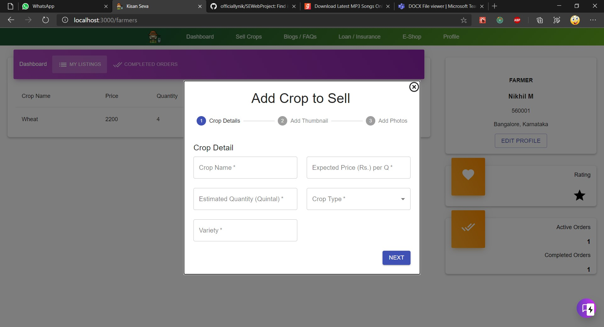
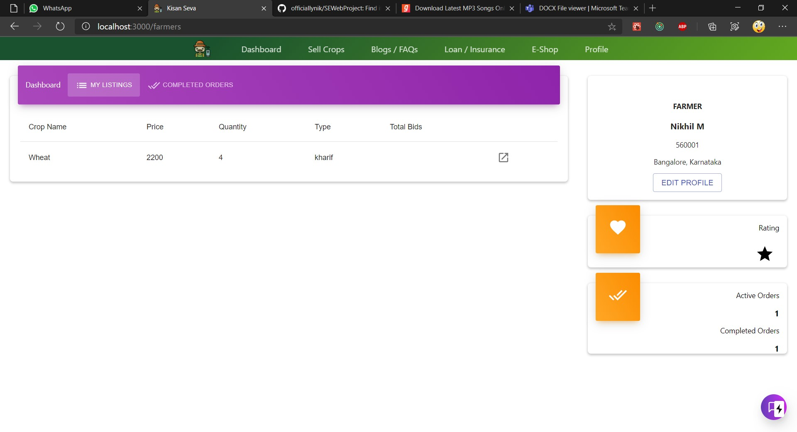
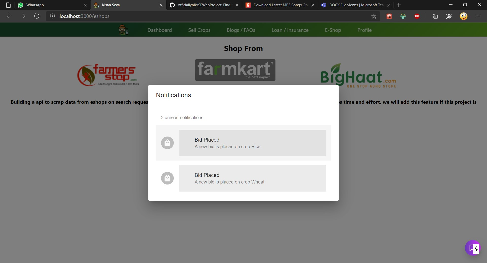
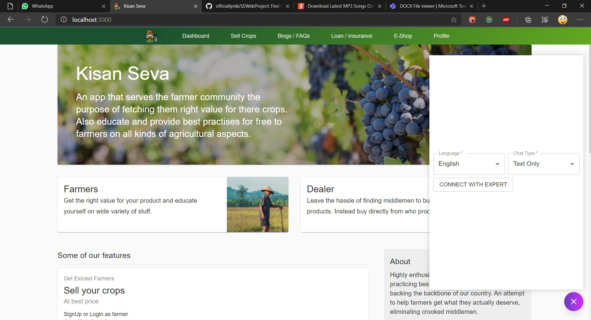

# Kisan Seva

## Farmer Documentation

### Features offered to the farmer
* Sell crops using form
* Manage crops using dashboard
* Notifications for real time usage
* View bids on his crop to accept/contact dealer
* Chat-with-experts to get help
* EShops to buy essentials
* Loan/Insurance (available in future releases)

``` All the above mentioned features are depicted in pictures below.```

``` We will be adding 'gifs' to futher improve the documentation. Thanks for your patience. ```

### Sell Crops


### Dashboard


### Notifications


### View Bid


### Chat-with-experts


### EShops


## Quick Links
* ### [Home](../../README.md)
* ### [Dealer Documentation](./dealers.md)
* ### [Expert Documentation](./expert.md)
* ### [General Documentation](./general.md)